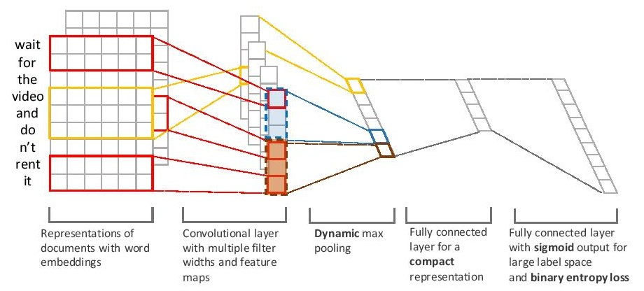

# XML-CNN
  Pytorch implementation of the paper [Deep Learning for Extreme Multi-label Text Classification](http://nyc.lti.cs.cmu.edu/yiming/Publications/jliu-sigir17.pdf) with dynamic pooling

## Dependencies

* NLTK (stopwords)
* Pytorch >= 0.3.1
* Gensim
* Matplotlib



Directory Structure:

```
+-- code
|   +-- cnn_test.py  
|   +-- cnn_train.py
|   +-- header.py
|   +-- main.py
|   +-- models
|   |   +-- classifier.py
|   |   +-- cnn_encoder.py
|   |   +-- embedding_layer.py
|   |   +-- header.py
|   |   +-- xmlCNN.py
|   +-- precision_k.py
|   +-- score_matrix.mat
|   +-- test_manik.m
+-- datasets
|   +-- Folder where datasets need to be kept
+-- embedding_weights
+-- saved_models
|   +-- Directory created by default where models are saved
+-- utils
|   +-- data_dive.py
|   +-- data_helpers.py
|   +-- fiddle_clusters.py
|   +-- futils.py
|   +-- loss.py
|   +-- process_eurlex.py
|   +-- w2v.py
+-- README.md
```
Glove embeddings are needed by default as pre-training for the model. They can be download from [here](https://nlp.stanford.edu/projects/glove/) and placed in ```embedding_weights``` directory. The Default embedding dimension is 300 with 840 Billion (840B) tokens. Otherwise you can set --model_variation = 0 for starting from scratch.


#### To train RCV1 dataset
```bash
python main.py --mn=rcv # train a model and save in directory rcv [inside saved_models]
```
This will create multiple files inside the folder ```saved_models/rcv``` in the above case. Checkpoints are saved after every 
```save_step``` epochs, this can be changed with ``--ss`` option in command line. Also a checkpoint is made according to best test precision@1 score and best training batch precision@1.


#### To train RCV1 from saved model
```bash
python main.py --lm=$DESTINATION_OF_SAVED_MODEL # This resumes training from the given checkpoint
```

#### To test RCV1 dataset
```bash
python main.py --lm=$DESTINATION OF SAVED MODEL --tr=0 
```

#### To train wiki10-31K dataset (with best set of hyper-parameters)
```bash
PYTHONUNBUFFERED=1 python main.py --mb=128  --ss=499 --sequence_length=5000 --load_data=1  --hidden_dims=1024 --vocab_size=100000 --mn=wiki --e=500  --ds=Wiki10-31K > out_wiki.txt
```

#### To train wiki10-31k from saved model
```bash
PYTHONUNBUFFERED=1 python main.py --sequence_length=5000 --load_data=1  --hidden_dims=1024 --vocab_size=100000 --mn=wiki  --ds=Wiki10-31K --lm=../saved_models/wiki10/model_best_test >> out_wiki.txt
```

#### To test wiki10-31K from saved model
```bash
PYTHONUNBUFFERED=1 python main.py --sequence_length=5000 --load_data=1  --hidden_dims=1024 --vocab_size=100000 --mn=wiki  --ds=Wiki10-31K --lm=../saved_models/wiki10/model_best_test --tr=0 > out_wiki_test.txt
```

#### To train Eurlex dataset (with best set of hyper-parameters)
```bash
PYTHONUNBUFFERED=1 python main.py --mb=128 --ss=499 --sequence_length=10000 --load_data=1  --hidden_dims=1024 --vocab_size=150000 --mn=eurlex --e=500  --ds=Eurlex  > out_eurlex.txt 
```

#### To train wiki10-31k from saved model
```bash
PYTHONUNBUFFERED=1 python main.py --ss=250 --sequence_length=5000 --load_data=1  --hidden_dims=1024 --vocab_size=100000 --mn=eurlex --e=500  --ds=EUR-Lex --lm=../saved_models/eurlex/model_best_test >> out_wiki.txt
```

#### To test wiki10-31K from saved model
```bash
PYTHONUNBUFFERED=1 python main.py --ss=250 --sequence_length=5000 --load_data=1  --hidden_dims=1024 --vocab_size=100000 --mn=eurlex --e=500  --ds=EUR-Lex --lm=../saved_models/eurlex/model_best_test --tr=0 > out_eurlex_test.txt
```

#### Saved 1024D embeddings
[Link](https://drive.google.com/open?id=1Z7aBB68bsM0iZjjuRE3gQNcYP6tZGtoc) 


